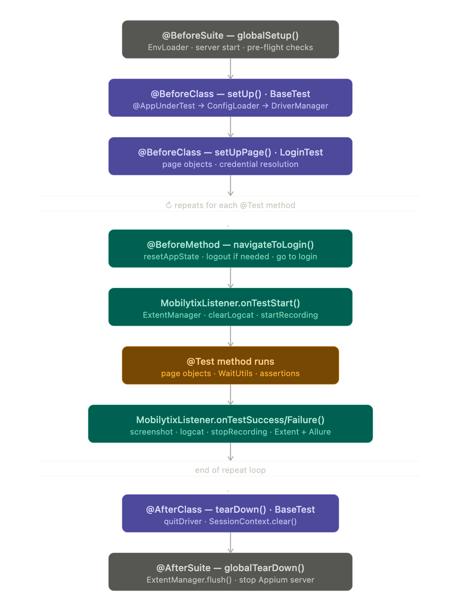

# Mobilytix


A reusable Android automation framework built with Java, Appium 2.x or later, and Maven.

## Features

- Page Object Model with a decoupled logic layer
- `@AppUnderTest` annotation to switch apps via config — no code changes
- Automatic or manual Appium server management
- ADB wrapper for low-level device commands
- Built-in authentication handling — OTP, SSO, basic, and none
- Dual reporting — Allure and ExtentReports
- Parallel execution via TestNG ThreadLocal driver management
- Central APK store

## Setup

See [SETUP.md](SETUP.md) for full environment setup instructions.

## Project Structure

See [docs/PROJECT_SCAFFOLD.md](docs/PROJECT_SCAFFOLD.md) for the folder layout.

## Adding a New App

1. Drop the APK into `apks/your_app/`
2. Add the app config block to `config/config.yaml`
3. Create page objects under `src/main/java/io/mobilytix/pages/your_app/`
4. Write tests under `src/test/java/io/mobilytix/tests/your_app/`
5. Register the test class in `testng.xml`

No framework code changes required.

## Running Tests

```bash
# Run all tests
./mvnw clean test

# Run parallel suite
./mvnw clean test -Dtestng.suite=testng-parallel.xml

# Generate Allure report
./mvnw allure:serve
```

## Configuration Overrides

See [docs/ENV_OVERRIDE_GUIDE.md](docs/ENV_OVERRIDE_GUIDE.md) for overriding
`config.yaml` values via command line, `.env` file, or environment variables.

## Rebrand

See the rebrand guide in [docs/PROJECT_SCAFFOLD.md](docs/PROJECT_SCAFFOLD.md) section 1.2.

## Test Applications

The framework is tested against two reference applications.
Download the APKs and place them in the `apks/` folder as shown.

### Sauce Labs Demo App (primary)

The main reference app used for framework examples and test coverage.
Covers catalog browsing, login, cart, checkout, and account management.

**Download:**
[https://github.com/saucelabs/my-demo-app-android/releases](https://github.com/saucelabs/my-demo-app-android/releases)

**Place at:** `apks/sauce_demo/MyDemoAppAndroid.apk`

**Test credentials:**

```bash
Username: bob@example.com
Password: 10203040
```

 ```bash
adb shell pm path sk.styk.martin.apkanalyzer
adb pull <path-from-above> apks/app_a/apkanalyzer.apk
```
### Test lifecycle

